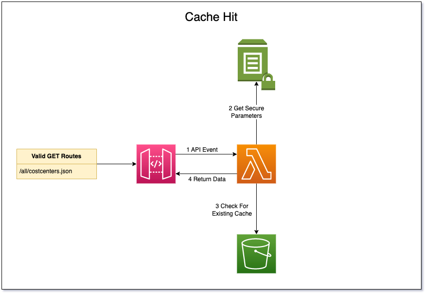
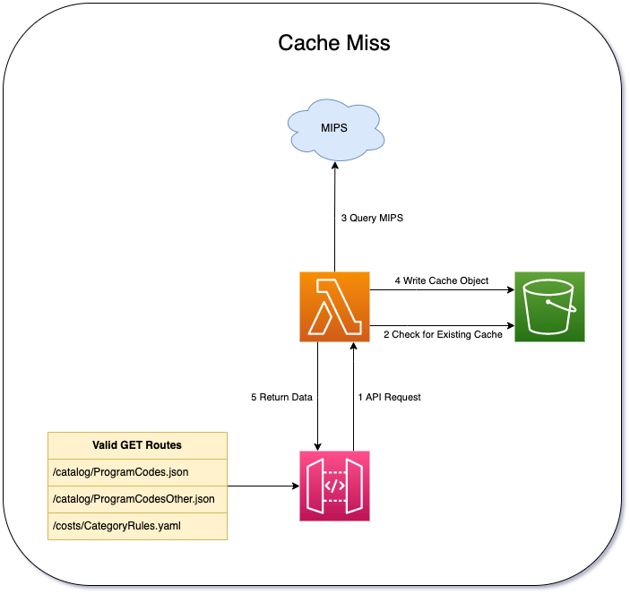
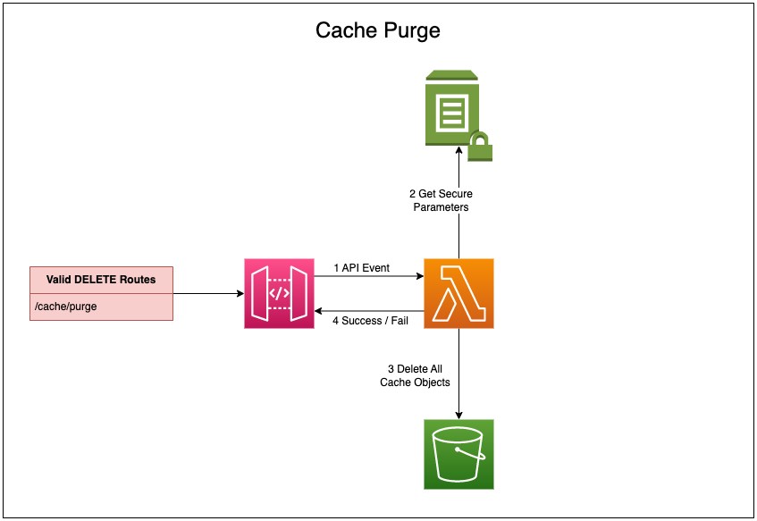
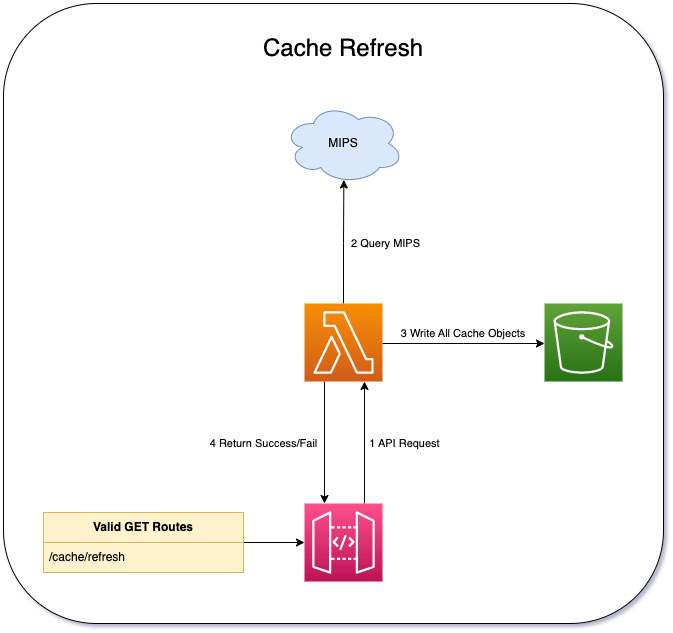

# lambda-mips-api
An AWS Lambda for interacting with MIPS and caching transformed data

## Architecture

Under normal operation a cache object is requested, and if found and not expired, it will be returned.
Otherwise the cache object will be created, stored, and returned.





Additionally, two management operations are supported: purging all cache objects and recreating all cache objects.





## Development

### Contributions
Contributions are welcome.

### Install Requirements
Run `pipenv install --dev` to install both production and development
requirements, and `pipenv shell` to activate the virtual environment. For more
information see the [pipenv docs](https://pipenv.pypa.io/en/latest/).

After activating the virtual environment, run `pre-commit install` to install
the [pre-commit](https://pre-commit.com/) git hook.

### Update Requirements
First, make any needed updates to the base requirements in `Pipfile`,
then use `pipenv` to regenerate both `Pipfile.lock` and
`requirements.txt`. We use `pipenv` to control versions in testing,
but `sam` relies on `requirements.txt` directly for building the
container used by the lambda.

```shell script
$ pipenv update
$ pipenv requirements > requirements.txt
```

Additionally, `pre-commit` manages its own requirements.
```shell script
$ pre-commit autoupdate
```

### Create a local build

```shell script
$ sam build
```

### Run unit tests
Tests are defined in the `tests` folder in this project. Use PIP to install the
[pytest](https://docs.pytest.org/en/latest/) and run unit tests.

```shell script
$ python -m pytest tests/ -v
```

### Run integration tests
Running integration tests
[requires docker](https://docs.aws.amazon.com/serverless-application-model/latest/developerguide/sam-cli-command-reference-sam-local-start-api.html)

```shell script
$ sam local invoke Function --event events/event.json
```

## Deployment

### Deploy Lambda to S3
Deployments are sent to the
[Sage cloudformation repository](https://bootstrap-awss3cloudformationbucket-19qromfd235z9.s3.amazonaws.com/index.html)
which requires permissions to upload to Sage
`bootstrap-awss3cloudformationbucket-19qromfd235z9` and
`essentials-awss3lambdaartifactsbucket-x29ftznj6pqw` buckets.

```shell script
sam package --template-file .aws-sam/build/template.yaml \
  --s3-bucket essentials-awss3lambdaartifactsbucket-x29ftznj6pqw \
  --output-template-file .aws-sam/build/lambda-mips-api.yaml

aws s3 cp .aws-sam/build/lambda-mips-api.yaml s3://bootstrap-awss3cloudformationbucket-19qromfd235z9/lambda-mips-api/master/
```

## Publish Lambda

### Private access
Publishing the lambda makes it available in your AWS account.  It will be accessible in
the [serverless application repository](https://console.aws.amazon.com/serverlessrepo).

```shell script
sam publish --template .aws-sam/build/lambda-mips-api.yaml
```

### Public access
Making the lambda publicly accessible makes it available in the
[global AWS serverless application repository](https://serverlessrepo.aws.amazon.com/applications)

```shell script
aws serverlessrepo put-application-policy \
  --application-id <lambda ARN> \
  --statements Principals=*,Actions=Deploy
```

## Install Lambda into AWS

### Sceptre
Create the following [sceptre](https://github.com/Sceptre/sceptre) file
config/prod/lambda-mips-api.yaml

```yaml
template:
  type: http
  url: "https://PUBLISH_BUCKET.s3.amazonaws.com/lambda-mips-api/VERSION/lambda-mips-api.yaml"
stack_name: "lambda-mips-api"
stack_tags:
  Department: "Platform"
  Project: "Infrastructure"
  OwnerEmail: "it@sagebase.org"
```

Install the lambda using sceptre:
```shell script
sceptre --var "profile=my-profile" --var "region=us-east-1" launch prod/lambda-mips-api.yaml
```

### AWS Console
Steps to deploy from AWS console.

1. Login to AWS
2. Access the
[serverless application repository](https://console.aws.amazon.com/serverlessrepo)
-> Available Applications
3. Select application to install
4. Enter Application settings
5. Click Deploy

## Releasing

We have setup our CI to automate a releases.  To kick off the process just create
a tag (i.e 0.0.1) and push to the repo.  The tag must be the same number as the current
version in [template.yaml](template.yaml).  Our CI will do the work of deploying and publishing
the lambda.
