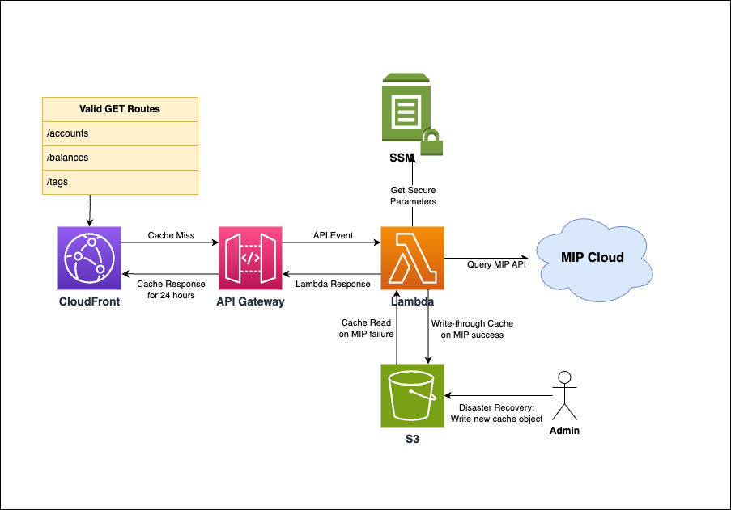

# lambda-mips-api
An AWS Lambda microservice presenting MIPS chart of accounts data

## Architecture

This microservice is designed to retrieve a chart of accounts from a third-party
API and present the data in a useful format.

Formats available:

| API Route | Description                                                              |
|-----------|--------------------------------------------------------------------------|
| /accounts | A dictionary mapping the chart of accounts to their friendly names.      |
| /tags     | A list of valid tag values for either `CostCenter` or `CostCenterOther`. |

Since we reach out to a third-party API across the internet, responses are
cached to minimize interaction with the API and mitigate potential
environmental issues (e.g. packet loss).



In the event of a cache miss in Cloudfront, an API gateway request will trigger the lambda,
which will read login credentials from secure parameters in SSM, query MIPS for the latest chart of accounts,
and return a JSON mapping of the data to be stored in Cloudfront for a default of one day.

In the event of a cache hit, Cloudfront will return the cached value without triggering an API gateway event.

### Default Behavior

By default, the lambda will process the chart of accounts received to remove
inactive codes, deduplicate the significant portion of active codes, and add
a "No Program" entry mapped to a code configured in a template parameter. Each
of these actions can be toggled with query-string parameters, except for
deduplication.

Specific account codes from the chart of accounts can be ignored globally with
the `CodesToOmit` template parameter. Remaining codes will be returned in
numeric order as either a list of strings or a json dictionary depending on the
API route.

### Required Secure Parameters

User credentials for logging in to the finance system are stored as secure parameters with a configurable prefix.
By default, the prefix is `/lambda/mipsSecret`, resulting the following required secure parameters:
* `/lambda/mipsSecret/user`
* `/lambda/mipsSecret/pass`

### Template Parameters

The following template parameters are used to configure CloudFormation resources

| Template Parameter | Description                                                       |
|--------------------|-------------------------------------------------------------------|
| CacheTTL           | TTL value for CloudFront cache objects.                           |
| SsmAliasPrefix     | Prepend this value to the Alias Name of the KMS key created.      |
| SsmKeyAdminArn     | Grant KMS admin access to these ARNs for managing secure secrets. |

The following template parameters are set as environment variables in the lambda environment:

| Template Parameter | Environment Variable | Description                                        |
| ------------------ | -------------------- |----------------------------------------------------|
| MipsOrganization   | MipsOrg              | Log in to this organization in the finance system. |
| SsmParamPrefix     | SsmPath              | Path prefix for required secure parameters.        |
| CodesToOmit        | CodesToOmit          | List of numeric codes to remove from output.       |
| NoProgramCode      | NoProgramCode        | Numeric code to use for "No Program" entry.        |
| OtherCode          | OtherCode            | Numeric code to use for "Other" entry.             |

### Query String Parameters

Several query-string parameters are available for either endpoint to configure
response output.

| Query String Parameter | Allowed Values                        |
|------------------------|---------------------------------------|
| show_other_code        | "on" or "yes" or "true"               |
| hide_no_program_code   | "on" or "yes" or "true"               |
| show_inactive_codes    | "on" or "yes" or "true"               |
| priority_codes         | Comma-separated list of numeric codes |
| limit                  | Integer                               |

A `show_other_code` parameter is available to optionally include an "Other"
entry in the output with a value from the `OtherCode` parameter. Defining any
non-false value for this parameter will include the code.

A `hide_no_program_code` parameter is available to prevent the default addition
of a "No Program" entry, otherwise it will be added with the value from the
`NoProgramCode` parameter. Defining any non-false value for this parameter will
prevent the addition of a "No Program" entry.

A `show_inactive_codes` parameter is available to prevent the default removal of
inactive codes. If this parameter is set to any non-false value, inactive codes
will be included in the output.

By default, the output is ordered by numeric code. A `priority_codes` parameter
is available to select specific programs to prioritize to the beginning of the
output regardless of their code; `OtherCode` and`NoProgramCode` are always
prioritized when included. Example value: `123456,654321`.

A `limit` parameter is available to restrict the number of items returned. This
value must be a positive integer, a value of zero disables the parameter.

### Triggering

The CloudFormation template will output all available endpoint URLs for triggering the lambda, e.g.:
`https://abcxyz.cloudfront.net/accounts`
`https://abcxyz.cloudfront.net/tags`

These URLs can be also constructed by appending the API Gateway paths to the CloudFormation domain.

#### Origin URL

The CloudFormation template also outputs the origin URL behind the CloudFront distribution for debugging purposes.

### Response Formats

#### /accounts

The `/accounts` endpoint will return a json string representing a dictionary
mapping numeric account codes to their friendly names.

E.g.:

`/accounts?show_inactive_codes=on`
```json
{
  "000000": "No Program",
  "123456": "Duplicate 1",
  "54321": "Inactive",
  "990300": "Platform Infrastructure"
}
```

#### /tags

The `/tags` endpoint will return a json string representing a list of valid
values for CostCenter tags. A valid CostCenter tag value takes the form
'{Friendly Name} / {Numeric Code}'.

E.g.:

`/tags?show_other_code=on`
```json
[
  "No Program / 000000",
  "Other / 000001",
  "Duplicate 1 / 123456",
  "Platform Infrastructure / 990300"
]
```

### CloudFront Cache

This lambda is expected to run less frequently than the 15-minute expiry for
lambda environments, which means most lambda runs will require a cold start.
We also expect the third-party API data to change much less frequently than the
lambda is called. And so we add a CloudFront cache to store the lambda
responses, reducing our reliance on the third-party API and minimizing the
impact of the lambda cold starts by calling the lambda less frequently.

If a bad response has been cached, it may need to be [manually invalidated through Cloudfront](https://aws.amazon.com/premiumsupport/knowledge-center/cloudfront-clear-cache/).

### S3 Cache

In addition to a web cache storing responses sent from the lambda, we also have
a write-through cache of the successful responses received from the upstream API
written to an S3 object in order to add fault tolerance in the event of upstream
API failures. And bucket versioning for the cache object gives us the ability to
access any previous successful upstream API responses, historic data that may be
useful during disaster recovery. Alternatively, during upstream API outages any
arbitrary cache object written to S3 by a cloud admin would be treated as
authoritative upstream information.

For more information on S3 versioning workflows, see [How S3 Versioning Works](https://docs.aws.amazon.com/AmazonS3/latest/userguide/versioning-workflows.html)
and [Restoring Previous Versions](https://docs.aws.amazon.com/AmazonS3/latest/userguide/RestoringPreviousVersions.html).

## Development

### Contributions
Contributions are welcome.

### Install Requirements

Run `pipenv install --dev` to install both production and development
requirements, and `pipenv shell` to activate the virtual environment. For more
information see the [pipenv docs](https://pipenv.pypa.io/en/latest/).

After activating the virtual environment, run `pre-commit install` to install
the [pre-commit](https://pre-commit.com/) git hook.

### Update Requirements

First, make any needed updates to the base requirements in `Pipfile`, then use
`pipenv` to regenerate both `Pipfile.lock` and `requirements.txt`.

```shell script
$ pipenv update --dev
```

We use `pipenv` to control versions in testing, but `sam` relies on
`requirements.txt` directly for building the lambda artifact, so we dynamically
generate `requirements.txt` from `Pipfile.lock` before building the artifact.
The file must be created in the `CodeUri` directory specified in
`template.yaml`.

```shell script
$ pipenv requirements > requirements.txt
```

Additionally, `pre-commit` manages its own requirements.

```shell script
$ pre-commit autoupdate
```

### Create a local build

Use a Lambda-like docker container to build the Lambda artifact

```shell script
$ sam build --use-container
```

### Run unit tests

Tests are defined in the `tests` folder in this project, and dependencies are
managed with `pipenv`. Install the development dependencies and run the tests
using `coverage`.

```shell script
$ pipenv run coverage run -m pytest tests/ -svv
```

Automated testing will upload coverage results to [Coveralls](coveralls.io).

### Run integration tests
Running integration tests
[requires docker](https://docs.aws.amazon.com/serverless-application-model/latest/developerguide/sam-cli-command-reference-sam-local-start-api.html)

```shell script
$ sam local invoke Function --event events/event.json
```

## Deployment

### Deploy Lambda to S3
Deployments are sent to the
[Sage cloudformation repository](https://bootstrap-awss3cloudformationbucket-19qromfd235z9.s3.amazonaws.com/index.html)
which requires permissions to upload to Sage
`bootstrap-awss3cloudformationbucket-19qromfd235z9` and
`essentials-awss3lambdaartifactsbucket-x29ftznj6pqw` buckets.

```shell script
sam package --template-file .aws-sam/build/template.yaml \
  --s3-bucket essentials-awss3lambdaartifactsbucket-x29ftznj6pqw \
  --output-template-file .aws-sam/build/lambda-mips-api.yaml

aws s3 cp .aws-sam/build/lambda-mips-api.yaml s3://bootstrap-awss3cloudformationbucket-19qromfd235z9/lambda-mips-api/master/
```

## Publish Lambda

### Private access
Publishing the lambda makes it available in your AWS account.  It will be accessible in
the [serverless application repository](https://console.aws.amazon.com/serverlessrepo).

```shell script
sam publish --template .aws-sam/build/lambda-mips-api.yaml
```

### Public access
Making the lambda publicly accessible makes it available in the
[global AWS serverless application repository](https://serverlessrepo.aws.amazon.com/applications)

```shell script
aws serverlessrepo put-application-policy \
  --application-id <lambda ARN> \
  --statements Principals=*,Actions=Deploy
```

## Install Lambda into AWS

### Sceptre
Create the following [sceptre](https://github.com/Sceptre/sceptre) file
config/prod/lambda-mips-api.yaml

```yaml
template:
  type: http
  url: "https://PUBLISH_BUCKET.s3.amazonaws.com/lambda-mips-api/VERSION/lambda-mips-api.yaml"
stack_name: "lambda-mips-api"
stack_tags:
  Department: "Platform"
  Project: "Infrastructure"
  OwnerEmail: "it@sagebase.org"
```

Install the lambda using sceptre:
```shell script
sceptre --var "profile=my-profile" --var "region=us-east-1" launch prod/lambda-mips-api.yaml
```

### AWS Console
Steps to deploy from AWS console.

1. Login to AWS
2. Access the
[serverless application repository](https://console.aws.amazon.com/serverlessrepo)
-> Available Applications
3. Select application to install
4. Enter Application settings
5. Click Deploy

## Releasing

We have setup our CI to automate a releases.  To kick off the process just create
a tag (i.e 0.0.1) and push to the repo.  The tag must be the same number as the current
version in [template.yaml](template.yaml).  Our CI will do the work of deploying and publishing
the lambda.
